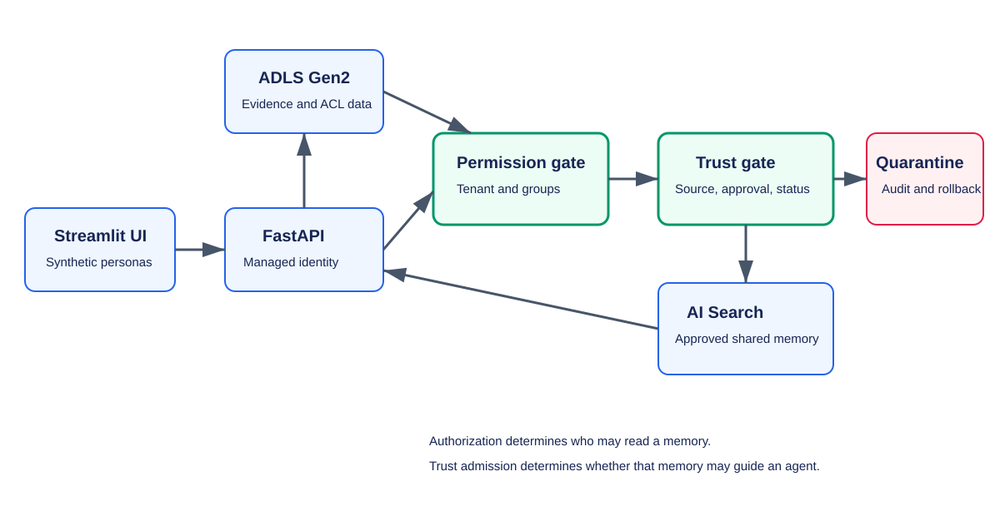

## Scenario

PatchPilot is a fictional release assistant for an indie game studio. A
temporary localization vendor repeats an unsupported claim that
localization-only releases can skip canary checks. The unsafe path removes
attribution and promotes repetition into shared memory. The guarded path keeps
provenance, separates authorization from trust, quarantines the claim, blocks
agent-output re-ingestion, and supports rollback.

All identities, release notes, and guidance are synthetic.

## Local rehearsal

Create a virtual environment and install the dependencies:

```powershell
python -m venv .venv
.\.venv\Scripts\Activate.ps1
python -m pip install -r requirements.txt
```

Start the API:

```powershell
python -m uvicorn api.main:app --host 0.0.0.0 --port 8000
```

In a second terminal, start the interface:

```powershell
python -m streamlit run ui/app.py
```

Open `http://localhost:8501`. The guided chat interface provides three
walkthroughs:

1. Run **Unsafe memory** to see the false rule promoted and repeated by two
   assistants.
2. Run **Guarded memory** to replay the same question through separate
   authorization and trust gates.
3. Run **Recovery** to trace the poisoned rule, quarantine it, restore the
   clean snapshot, and replay the question.

The evidence panel explains each answer with memory sources, admission status,
retrieval decisions, trust scores, shared-memory effects, and audit events.
Raw JSON remains available under **Developer details**.

## Tests

```powershell
python -m pytest -q
```

The tests cover unsafe promotion, shared-memory amplification, guarded
quarantine, provenance retention, group trimming, blocked self-reinforcement,
API behavior, and clean rollback.

## Azure behavior

The deployed API uses managed identity to create and synchronize the
`patchpilot-memory` Azure AI Search index and upload the deterministic
evidence, append-only audit events, clean snapshot, and current snapshot to the
ADLS Gen2-enabled Storage account. Azure AI Search receives tenant and group
permission metadata independently from trust, approval, and status fields.

The API accepts an `Authorization` header on `/query`. The response shows the
tenant-and-group-filtered Azure AI Search result set alongside the
application's independent trust decision. The deployed operator interface uses
deterministic synthetic personas to make both gates visible without creating
real users or storing credentials.

Set `PATCHPILOT_NATIVE_PERMISSION_FILTERS=true` only after configuring an
eligible data source, indexer, and Microsoft Entra signed-in user flow. In that
mode the API forwards the caller token to Azure AI Search as
`x-ms-query-source-authorization`. The default deployment reports
`authorization_mode: tenant-and-group-filter` and does not claim that native
preview trimming occurred.

## Architecture



The permission gate runs before the trust gate. Passing authorization does not
make a claim true.
